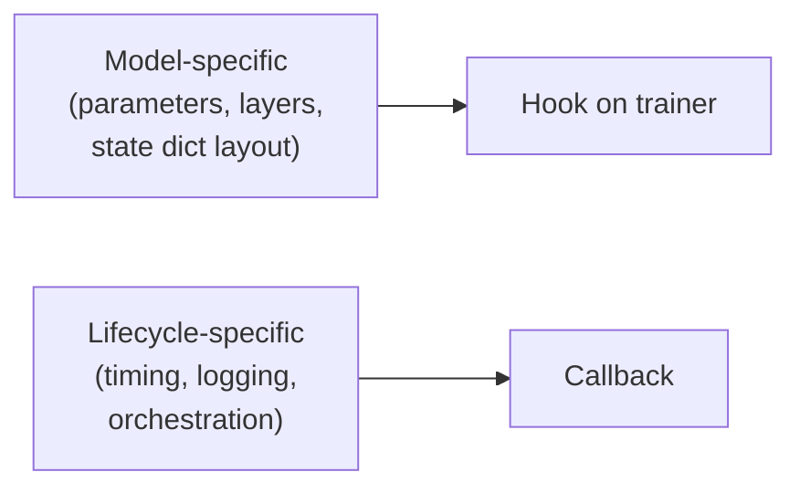

# Core Concepts

<small>📖 Explanation · ~10 min read · no runnable code</small>

!!! abstract "TL;DR"
    - A training loop has **~5 things that change per project** and **~20 things that don't**. Dream Trainer absorbs the 20.
    - The **lifecycle** is a fixed ordering: world → mesh → configure → materialize → init_weights → optimizers → fit.
    - **Mixins** care about what the model *is*. **Callbacks** care about what the trainer is *doing*.
    - The **device mesh** is a named coordinate system — `(pp, dp_replicate, dp_shard, cp, tp)` — not a flat rank list.

A PyTorch training loop has five things that change per project — the model, the data, the loss, the optimizer, and (sometimes) the parallelism strategy — and about twenty things that don't. The twenty are where distributed bugs live. Dream Trainer exists to absorb the twenty so you can keep the five explicit.

This page builds the mental model. [Quick Start](getting-started.md) shows the same model running as code.

## The Lifecycle

When you call `trainer.fit()`, Dream Trainer runs the same sequence for every trainer, every time. The ordering is load-bearing: the distributed world has to exist before you can build a mesh, the mesh has to exist before you can apply parallelism, meta tensors have to be materialized before you can build an optimizer over them.

--8<-- "includes/lifecycle.md"

Read the diagram top-to-bottom. The yellow nodes are hooks you implement on your trainer. Everything else is owned by Dream Trainer. If a parallelism dimension is disabled in your `DeviceParameters` (say `_tensor_parallel=1`), the corresponding yellow hook isn't called — you don't have to implement `apply_tensor_parallel` for a single-GPU run.

!!! warning "The ordering is not a suggestion"
    `init_weights` runs **after** materialization, not inside `configure_models`. If you initialize weights in `configure_models`, you are initializing meta tensors and the initialization is silently discarded. This is the single most common first bug. See [Debugging](debugging.md#meta-tensors-remain-after-setup).

Three phases in the diagram deserve their own treatment.

## The Device Mesh

Think of the device mesh as a **named coordinate system** for the processes in your run. Instead of every process knowing only "I am rank 7 of 64," each process knows its coordinate along each named dimension: `(pp=0, dp_replicate=1, dp_shard=2, cp=0, tp=3)`. Collective operations project onto a subset of dimensions — "all-reduce across `tp`" or "gather along `dp_shard`" — without manual process-group math.

`DistributedWorld` builds the mesh from `DeviceParameters`:

| Dimension | Role | When you use it |
| --- | --- | --- |
| `pp` | Pipeline parallel stages | Model too deep to fit per-GPU even sharded; you split the graph across stages. |
| `dp_replicate` | Full model replication (DDP-style) | Model fits on one GPU; you want more data throughput. |
| `dp_shard` | Parameter + gradient + optimizer-state sharding (FSDP-style) | Model doesn't fit replicated; you shard it. |
| `cp` | Context parallelism | Sequences too long for one GPU's activations. |
| `tp` | Tensor parallelism | Single layers' weight matrices don't fit; you shard within a layer. |

Dream Trainer also publishes useful flattened views — `dp`, `dp_shard+cp`, `dp+cp`, `cp+tp` — so trainer utilities can operate over the right process groups without you composing them by hand. When you reduce gradient norms, sample data rank-aware, or build DCP state, these flattened views are the correct thing to target.

!!! tip "Presets first, dimensions second"
    Start with a preset (`DeviceParameters.SINGLE_DEVICE()`, `.DDP()`, `.FSDP()`, `.HSDP(dp_shard=8)`). Only reach for explicit dimension values when you outgrow the presets — typically when you combine TP, PP, or CP with data parallelism.

The mesh is the shape of your run. Your checkpoints, your data sharding, your gradient reductions, your loss parallelism all project onto it. Read [Parallelism](parallelism.md) for the hook-by-hook walkthrough.

## Meta Device, Then Real Device

A 70B parameter model is about 140GB in BF16. No single GPU holds it. But you still want to write:

```python
def configure_models(self):
    self.model = MyLargeModel(self.config.model)
```

The trick is the **meta device**: a PyTorch mode where modules allocate their *structure* (parameter shapes, module hierarchy, buffer names) without allocating their *storage*. The model exists; it has no memory footprint. You can inspect `self.model.layers[0].attn.weight.shape`. You just can't do math with it.

Dream Trainer runs `configure_models` under a meta-device context. Then it:

1. Applies your parallelism hooks (`apply_tensor_parallel`, `apply_fully_shard`, etc.) — these operate on meta tensors, annotating the model with how it will be sharded.
2. **Materializes** the model on each rank's actual device. Each rank only allocates storage for the portion it owns.
3. Calls your `init_weights()` so you can initialize the now-real tensors (or load pretrained weights into them).

This split is why Dream Trainer has two separate hooks (`configure_models` and `init_weights`) instead of one. If you need to load pretrained weights, load them in `init_weights`, not `configure_models` — the tensors don't exist yet during configuration.

!!! danger "Do not build optimizers in `configure_models`"
    Optimizers must be constructed over real parameters, after materialization. That's why `configure_optimizers` runs later in the lifecycle. Building an Adam optimizer over meta tensors produces an Adam state that points to nothing.

## Mixins vs Callbacks

Dream Trainer distinguishes two extension points. The rule is sharp:

> **If the behavior cares about what the model *is*, it's a hook on the trainer (mixin). If it cares about what the trainer is *doing*, it's a callback.**

**Hooks / mixin methods** live on the trainer class. They need model internals — parameter groups, layer lists, state dict layout. `configure_models`, `init_weights`, `apply_tensor_parallel`, `configure_optimizers`, `training_step`, and `model_state_dict` are hooks. When you subclass `DreamTrainer`, you are implementing hooks.

**Callbacks** live outside the trainer class. They need *lifecycle events* — "I want to run code before every optimizer step" or "I want to save a checkpoint every 1000 steps" — but they don't need to know what your model does. `CheckpointCallback`, `ProgressBar`, `WandBLoggerCallback`, `EMACallback`, `Fp8Quantization`, `ProfileCallback` are all callbacks. A callback you write for one trainer drops into another.

This split matters because it tells you where a new capability goes. A custom gradient-clipping scheme is probably a hook (it cares about parameter groups). A custom "save a full model snapshot at epoch boundaries" behavior is a callback (it cares about when, not what).



See [Trainer Guide](trainer-guide.md) for the hook catalogue and [Callbacks](callbacks.md) for the callback catalogue.

## State And Checkpointing

`BaseTrainer.state_dict()` aggregates **everything a run needs to resume**: trainer counters, callback state, model state (via your `model_state_dict`), optimizer state, scheduler state, and dataloader state where available. `CheckpointCallback` and `AsyncCheckpointCallback` serialize that aggregate through PyTorch Distributed Checkpoint (DCP), so the same save/load path works whether your state lives on one GPU or is sharded across 256.

A few consequences:

- Implement `model_state_dict` using DCP helpers (`get_model_state_dict`) even for single-GPU trainers. This keeps the trainer ready for sharded state when you scale.
- Callbacks can participate in checkpoint state by implementing `state_dict` and `load_state_dict`. EMA averages, LR scheduler warmup, and custom counters resume cleanly this way.
- A checkpoint saved under one mesh shape can be loaded under a different mesh shape. You can train on 64 GPUs (`dp_shard=64`), checkpoint, and resume on 128 GPUs (`dp_shard=32, dp_replicate=4`) without rematerializing.

See [Checkpointing](checkpointing.md) for the full state layout and resumption modes.

## From Quick Start To Production

The [Quick Start](getting-started.md) is one file with synthetic data. A production trainer keeps the same shape but splits the pieces:

- `config.py` holds the `DreamTrainerConfig` subclass and named config factories (`local_config()`, `ddp_config()`, `fsdp_config()`).
- `train.py` holds the trainer class. Its hooks construct real models and dataloaders.
- `training_step` and `validation_step` stay explicit PyTorch.

The control flow doesn't change when you move from single GPU to distributed. The hooks you wrote on day 1 still run; Dream Trainer just picks up parallelism from `DeviceParameters` and calls the hooks that became relevant. That continuity is the payoff for the lifecycle discipline on this page.

## Next Steps

- [Trainer Guide](trainer-guide.md) — every hook in depth, with multi-model and frozen-module patterns.
- [Parallelism](parallelism.md) — hook-by-hook walkthrough of DDP, FSDP, TP, CP, PP.
- [Design Philosophy](design-philosophy.md) — why the API is shaped this way, in essay form.
