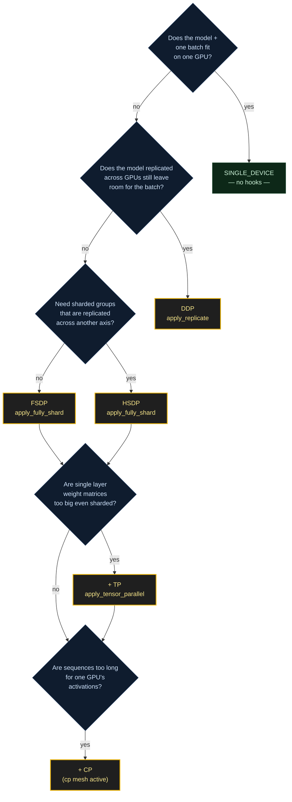

# Parallelism

<small>🛠️ How-to · decision-oriented</small>

!!! abstract "TL;DR"
    - **Batch too big?** → DDP (`apply_replicate`).
    - **Model too big, replicated?** → FSDP (`apply_fully_shard`).
    - **Need replicated shards?** → HSDP (`apply_fully_shard` + `dp_replicate > 1`).
    - **Single layers too big even sharded?** → add TP (`apply_tensor_parallel`).
    - **Sequences too long?** → add CP (`apply_context_parallel`).
    - **Model too deep?** → add PP (`apply_pipeline_parallel`).

Your single-GPU trainer works. Now one of three things happens: the batch size you want doesn't fit, the model itself doesn't fit, or the sequence length doesn't fit. Each of those is a different parallelism problem. This page walks you through picking the right mode for each — and wiring the hook Dream Trainer calls for you.

## Pick a mode first



The modes compose. A real training run is typically "FSDP + maybe TP + maybe CP", each activated by setting the corresponding `DeviceParameters` dimension and implementing the matching hook.

## Start With A Preset

```python
DeviceParameters.SINGLE_DEVICE(compile_model=False)   # 1 GPU, no hooks required
DeviceParameters.DDP()                                 # all GPUs replicate the model
DeviceParameters.FSDP()                                # all GPUs shard the model
DeviceParameters.HSDP(dp_shard=8)                      # 8-way shard groups, replicated
```

Reach for explicit dimensions only when you outgrow a preset — usually when you combine TP, CP, or PP with data parallelism.

## Data Parallel: DDP vs FSDP vs HSDP

=== "DDP"

    Full model replication across the `dp_replicate` dimension. Every GPU holds the full model and optimizer state; gradients are all-reduced at step time.

    ```python
    from torch.distributed._composable.replicate import replicate


    def apply_replicate(self, dp_replicate_mesh):
        replicate(self.model, device_mesh=dp_replicate_mesh)
    ```

    **Use when:** the model + one batch fits on a single GPU and you want more data throughput.

    **Cost:** every GPU pays the full model's memory footprint.

=== "FSDP"

    Parameter, gradient, and optimizer-state sharding across the `dp_shard` dimension. Each GPU only holds its shard; parameters are all-gathered per layer as needed.

    ```python
    from torch.distributed.fsdp import fully_shard


    def apply_fully_shard(self, config):
        for layer in self.model.layers:
            fully_shard(layer, **config)
        fully_shard(self.model, **config)
    ```

    **Use when:** the full model doesn't fit replicated on each GPU.

    **Cost:** per-layer all-gather traffic. Dream Trainer builds `config` from the mesh + mixed-precision settings. With CPU offload, it adds an offload policy automatically.

=== "HSDP"

    Hybrid: shard within groups of size `dp_shard`, replicate across `dp_replicate` groups. Same hook as FSDP — the mesh does the work.

    ```python
    def apply_fully_shard(self, config):
        for layer in self.model.layers:
            fully_shard(layer, **config)
        fully_shard(self.model, **config)
    ```

    **Use when:** you have enough GPUs that full-world FSDP's all-gather traffic becomes the bottleneck. HSDP keeps the all-gather within a smaller group and does replica-style gradient reduction across groups.

    **Cost:** requires tuning `dp_shard` against your interconnect topology — the shard dimension should line up with a fast intra-node interconnect (NVLink); the replicate dimension rides the slower inter-node fabric.

!!! tip "Rank-aware dataloaders are not optional under DP"
    Any mode that enables data parallelism (`dp_replicate > 1` or `dp_shard > 1`) needs dataloaders that shard over the data-parallel rank. Pass `rank=self.world.dp_rank, world_size=self.world.dp_size` to your dataloader factory. If you skip this, every data-parallel rank sees the same batch and gradients are perfectly redundant — silent correctness bug, not a crash.

## Tensor Parallelism

Tensor parallelism splits individual weight matrices across the `tp` mesh. Useful when a single layer's parameters don't fit even sharded (think: 128k-vocab embedding, attention projections in a dense 70B).

```python
from torch.distributed.tensor.parallel import parallelize_module


def apply_tensor_parallel(self, tp_mesh):
    parallelize_module(self.model, tp_mesh, plan=my_tp_plan)
```

The plan is **model-specific**. Dream Trainer does not infer tensor-parallel layouts, because the correct policy depends on which tensors share contraction dimensions. Define the plan alongside your model, not in the trainer.

!!! warning "Async TP requires compile"
    `async_tensor_parallel=True` on `DeviceParameters` requires `compile_model=True`. The async path transforms communication into compile-time scheduled collectives — without compile, the async scheduler has nothing to rewrite. If you disable compile for debugging, disable async TP too, or use a preset that already handles this.

## Context Parallelism

Context parallelism shards the **sequence dimension** across the `cp` mesh. Each rank processes a slice of tokens; attention operations are stitched back together via a specialized collective.

Context parallelism is activated by setting `_context_parallel > 1` in `DeviceParameters`. It does not require a new hook — it uses `self.world.train_context()` to switch on the right dispatch during training steps. Your attention implementation must support CP collectives; PyTorch's built-in scaled-dot-product attention handles this under the CP context manager.

**Use when:** long-sequence workloads — diffusion transformers at high resolution, long-context LLMs — where a single rank's activation memory is the bottleneck, not parameters.

## Pipeline Parallelism

Pipeline parallelism splits the model by layer into stages across the `pp` mesh, and schedules microbatches through the stages.

```python
def apply_pipeline_parallel(self, pp_mesh):
    # Define how the model is split and scheduled
    ...
```

PP is the most invasive parallelism mode — it changes the shape of `training_step` (you process microbatches, not whole batches) and requires the model to be split cleanly at layer boundaries. Keep the first multi-GPU trainer on DDP or FSDP unless the model genuinely requires pipeline partitioning.

## Compile Interacts With Everything

When `compile_model=True`, implement `apply_compile`:

```python
def apply_compile(self):
    self.model.compile(mode="max-autotune-no-cudagraphs", dynamic=False)
```

Dream Trainer calls `apply_compile` **before** FSDP/DDP wrapping, so the compiled graph sees the unwrapped module. This is the correct order for FSDP2 and composable DDP.

!!! danger "Compile surprises"
    - Compile before FSDP wrapping is **correct** and the order Dream Trainer enforces. Compile after FSDP is the common workaround you see online — it's incorrect for FSDP2.
    - If you also use `compiled_autograd=True`, expect higher compile times on first step and more graph breaks on dynamic shapes. `FindGraphBreaksCallback` helps you track down silent recompiles.

## How Launches Work

The `entrypoint` helper adapts to its environment:

| Environment | Behavior |
| --- | --- |
| Distributed env vars already set (torchrun, Slurm) | Use the provided world. |
| One visible CUDA device | Run as a single local process. |
| N visible CUDA devices (no env vars) | Launch N local processes. |

=== "Single GPU"

    ```bash
    CUDA_VISIBLE_DEVICES=0 python train.py
    ```

=== "Multi-GPU, one node"

    ```bash
    CUDA_VISIBLE_DEVICES=0,1,2,3 python train.py
    ```

=== "Multi-node (torchrun)"

    ```bash
    torchrun \
      --nproc-per-node=8 \
      --nnodes=$NNODES \
      --node-rank=$RANK \
      --master-addr=$MASTER_ADDR \
      --master-port=$MASTER_PORT \
      train.py
    ```

## Validation Checklist

Before you launch, mentally walk through:

- [ ] World size equals the product of active mesh dimensions — or at most one dimension is `"auto"`.
- [ ] Every enabled parallelism mode has the required hook implemented (`apply_replicate`, `apply_fully_shard`, `apply_tensor_parallel`, `apply_pipeline_parallel`, `apply_activation_checkpointing`, `apply_compile`).
- [ ] Dataloaders consume `self.world.dp_rank` and `self.world.dp_size`.
- [ ] `model_state_dict` returns DCP-compatible state (via `get_model_state_dict`).
- [ ] Compile + async-TP are either both on or both off.

## Next Steps

- [Checkpointing](checkpointing.md) — how DCP state maps across mesh shapes.
- [Performance](performance.md) — throughput tuning: FSDP prefetch, compile modes, activation checkpointing tradeoffs.
- [Debugging](debugging.md) — when a parallelism mode silently misbehaves.
