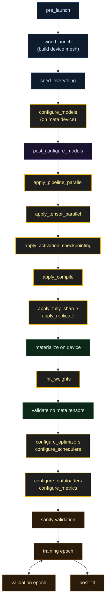

<!--
Canonical Dream Trainer lifecycle diagram.

Include with: --8<-- "includes/lifecycle.md"

The sequence mirrors BaseTrainer._fit (src/dream_trainer/trainer/base.py:898)
and SetupMixin._setup_models (src/dream_trainer/trainer/mixins/setup/setup.py:108
→ mixins/setup/models.py:696-704). Update this file when the source ordering
changes; it is the single source of truth for the lifecycle diagram across
the docs.
-->

<small>**Yellow** = hooks you implement on your trainer. **Other colors** = phases Dream Trainer owns. Parallelism hooks (PP / TP / ActCkpt / compile / FSDP or DDP) only run if the corresponding `DeviceParameters` dimension is enabled.</small>
